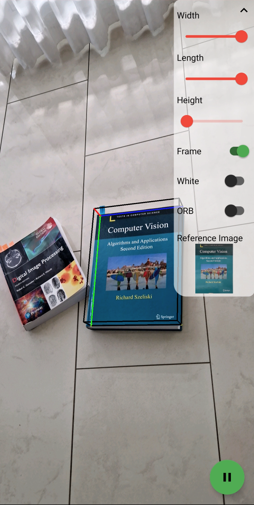
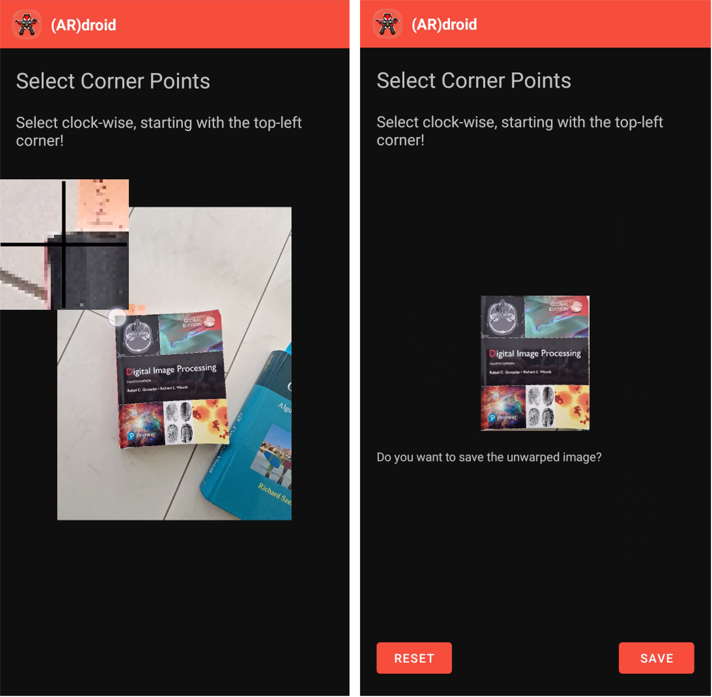
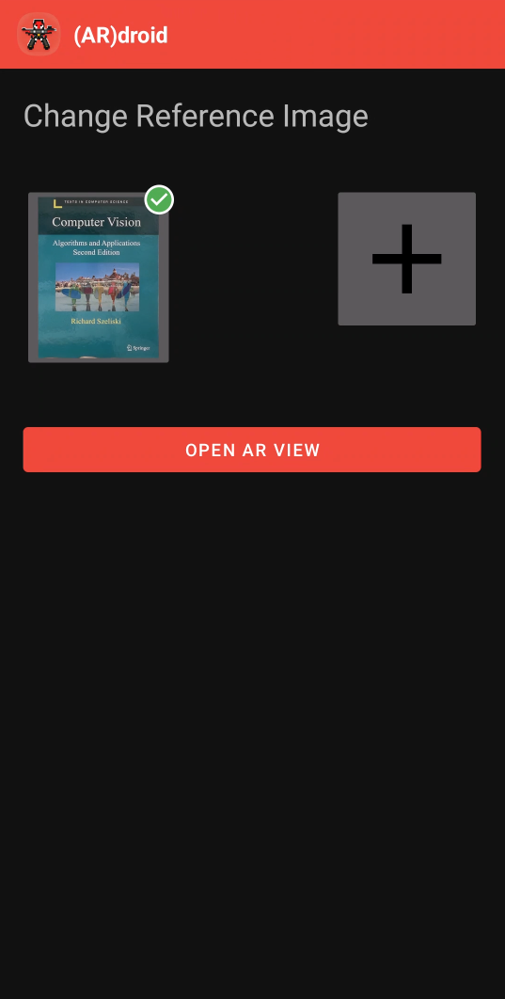
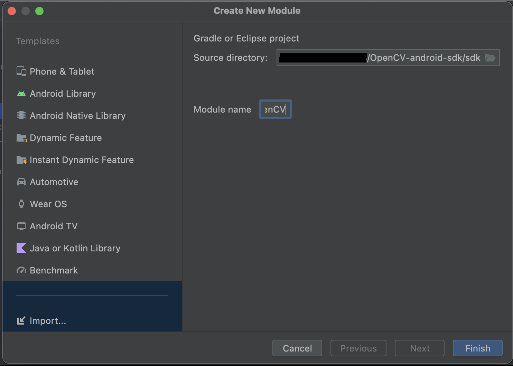

# (AR)droid
This project showcases Augmented Reality (AR) on Android by projecting a cube onto a reference object. 
It uses the OpenCV 4.8.0 SDK for Android and Kotlin. 

The Computer Vision algorithms have been taken from [Augmented Reality on Webcam](https://github.com/Wissiak/augmented-reality-on-webcam).
The mobile version has been rewritten to Kotlin and has been enhanced with some mobile functionalities. 
The goal of this project was not to improve performance but rather to show the feasibility of a simple AR project on mobile devices. Please also check out [Augmented Reality with 3D Rendering using Metal Shaders and OpenCV](https://github.com/Wissiak/augmented-reality-with-3d-rendering-using-metal-shaders-and-opencv) for a C++ version. 

Miniproject features: Kotlin (3P), Functionality (2P), Sensor (1P), libraries (1P)

## Showcase

https://github.com/Wissiak/augmented-reality-on-android/assets/31206249/c7113700-9fc7-4361-a9e4-379cadd26b5b

## Features
### AR Projection
The main feature of (AR)droid is to project a cube onto a reference plane which has been previously selected on the main screen.
- The projection screen allows to set the dimensions of the cube (i.e. width/length/height) whereas the width and length are in percentage of the reference image's dimensions and the height is arbitrary. 
- The coordinate axes of the cube can be toggled which are shown in red/green/blue.
- For dark reference images, it is also possible to use white edges for the cube.
- For faster computation but less reliable features, it is possible to use an ORB feature detector instead of SIFT.
- In the bottom right, the camera view can be paused and resumed.

### Unwarping images
In order to register reference images, an extra activity has been added to cut and unwarp the object of an image which can be used as reference image. 

---

Please note that the underlying technology (homography) **works only for planar objects**, e.g. book covers, flyers, paintings, etc. 

---

To add a reference image, one can either choose an image from the gallery or directly take an image from the camera.
Afterwards, the edges of the planar object can be selected. Currently, it is possible to select 4 edges and if done so, the edges will be unwarped to a rectangular shape.
It is recommended to select the corners in clockwise direction starting from the top-left point. 
Note that is also possible to start with any other point which will then be the origin for the cube placement but **clockwise corner selection is mandatory** for the projection task to work properly.
If the points are selected arbitrarily, undesired results can happen in the warping process but you can restart the selecting process by pressing "Reset".
If the unwarped result is satisfactory, the image can be saved - it is persistent upon app restart.

### Managing reference images
The main screen of (AR)droid allows to select a reference image which then will be used in the Projection screen.
To select an image, just tap on it. To delete a reference image, you can long press on an image and then hit "Delete". 
Upon clicking the '+', a new reference image can be registered.

## Project Setup
1. Download the OpenCV 4.8.0 Android SDK from [OpenCV Releases](https://opencv.org/releases/)
2. Unpack the downloaded folder to a folder of your choice (e.g. ~/tools/OpenCV-android-sdk)
3. Clone this repository
4. Open this repository in Android Studio
5. Open `Project Structure... > Modules` and click on `New Module`
---
**NOTE**
You might have to remove the module "openCV" first in order to add it again. For this, do the following: 
1. Comment out the following line in `app/build.gralde` and try again:
`implementation project(path: ':openCV')`
2. Go to `Project Structure... > Modules` and remove the openCV module.
3. Run Gradle sync

Afterwards you should be able to add it normally.

---
6. Click on `Import Module` and specify the unpacked folder with "/sdk" appended (e.g. ~/tools/OpenCV-android-sdk/sdk)

---
Remember to uncomment the line in `app/build.gralde` if you commented it out before:
`implementation project(path: ':openCV')`

---

7. Wait for Gradle build to (hopefully) finish successfully
8. Start the App! :)

## Notes
The ORB feature detector has been added to use a faster alternative to SIFT but, however, does not work with every reference image.
